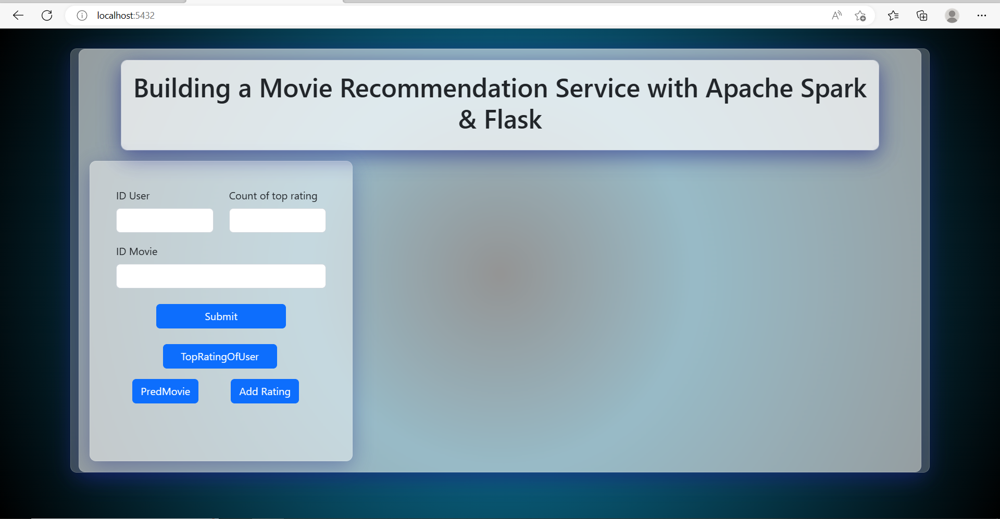
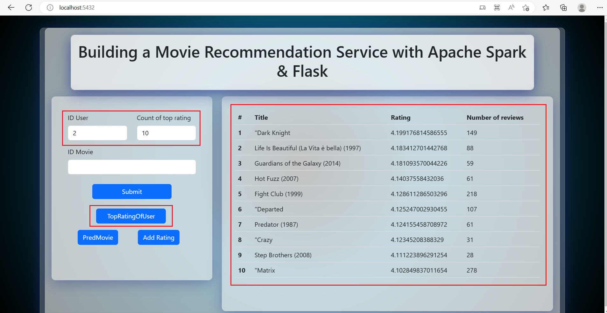
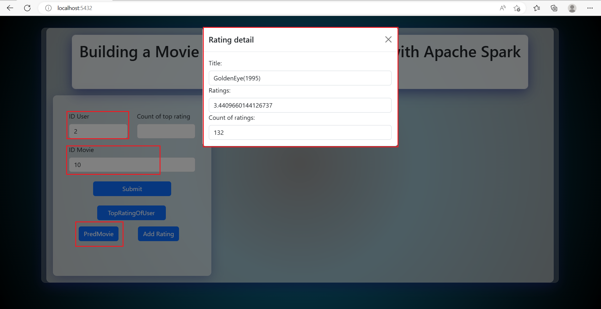

# Building a Movie Recommendation Service with Apache Spark & Flask

### Steps to start
#### 1. Install library
```pip install -r requirements.txt```

#### 2. Run file server.py to start website.
### Web page interface


#### Some features

1. Forecast top ratings movies
    After entering the user id information and the number of top ratings, we press the TopRatingOfUser button to display the top movies recommed information.


2. Forecast rating of one movie
    After entering the user id information and id of movie, we press the PredMovie button to display the rating of movie.



